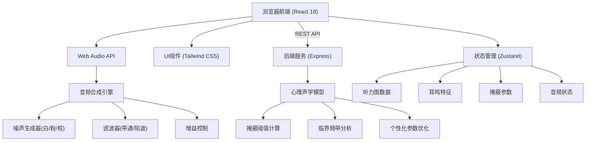

## 1. 架构设计



## 2. 技术描述
- **前端**：React@18 + TypeScript + Vite + TailwindCSS@3 + Zustand
- **初始化工具**：vite-init react-express-ts 模板
- **后端**：Express@4 + TypeScript
- **音频**：Web Audio API（浏览器端实时合成）
- **可视化**：原生Canvas API（听力图、波形图）
- **图标**：Lucide React

## 3. 路由定义

| 路由 | 用途 |
|-------|---------|
| / | 主工作台页面（所有功能集成单页） |

## 4. API 定义

### 4.1 计算听觉动态范围

**Request**
```typescript
interface AudiogramRequest {
  leftEar: { frequency: number; threshold: number }[];
  rightEar: { frequency: number; threshold: number }[];
}
```

**Response**
```typescript
interface DynamicRangeResponse {
  leftEar: {
    frequency: number;
    threshold: number;
    uncomfortableLevel: number;
    dynamicRange: number;
  }[];
  rightEar: {
    frequency: number;
    threshold: number;
    uncomfortableLevel: number;
    dynamicRange: number;
  }[];
}
```

### 4.2 计算掩蔽声参数

**Request**
```typescript
interface MaskingCalculationRequest {
  audiogram: AudiogramRequest;
  tinnitus: {
    frequency: number;
    loudness: number; // 1-10
    type: 'pure_tone' | 'narrowband' | 'broadband';
    ear: 'left' | 'right' | 'bilateral';
  };
}
```

**Response**
```typescript
interface MaskingParametersResponse {
  centerFrequency: number;      // Hz
  bandwidth: number;            // Hz (半带宽)
  soundLevel: number;           // dB SL
  noiseType: 'white' | 'pink' | 'brown' | 'notched';
  notchFrequency?: number;      // 陷波频率(如适用)
  recommendedDuration: number;  // 分钟
  explanation: string;          // 参数说明
}
```

### 4.3 后端服务文件结构
```
api/
├── index.ts              # Express入口
├── routes/
│   ├── audiogram.ts      # 听力图相关路由
│   └── masking.ts        # 掩蔽计算路由
├── services/
│   ├── audiogramService.ts    # 动态范围计算
│   └── psychoacousticModel.ts # 心理声学模型
└── types/
    └── index.ts          # 共享类型定义
```

### 4.4 前端文件结构
```
src/
├── App.tsx               # 主应用
├── main.tsx              # 入口
├── index.css             # 全局样式+Tailwind
├── store/
│   └── useAppStore.ts    # Zustand全局状态
├── components/
│   ├── AudiogramInput.tsx    # 听力图输入
│   ├── AudiogramChart.tsx    # 听力图可视化
│   ├── TinnitusConfig.tsx    # 耳鸣特征配置
│   ├── MaskingResult.tsx     # 掩蔽参数展示
│   ├── AudioPlayer.tsx       # 音频播放器
│   ├── ParameterTuner.tsx    # 参数微调
│   └── WaveformVisualizer.tsx # 波形可视化
├── hooks/
│   ├── useAudioEngine.ts     # Web Audio引擎Hook
│   └── useMaskingAPI.ts      # API调用Hook
├── utils/
│   ├── audiogram.ts          # 听力图计算工具
│   └── psychoacoustics.ts    # 心理声学辅助函数
└── types/
    └── index.ts              # 前端类型
```
